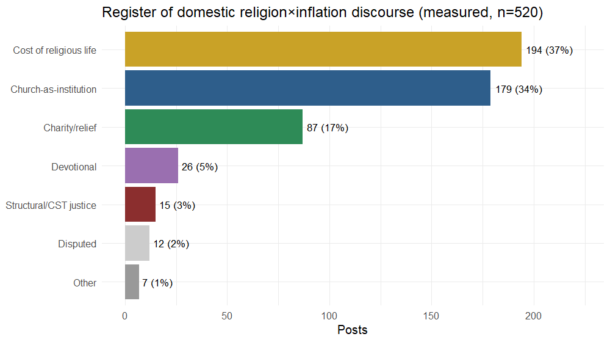
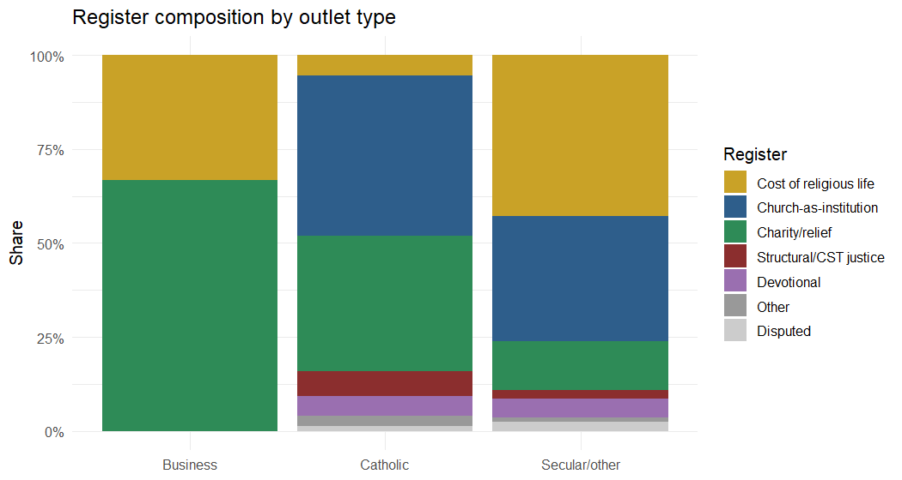
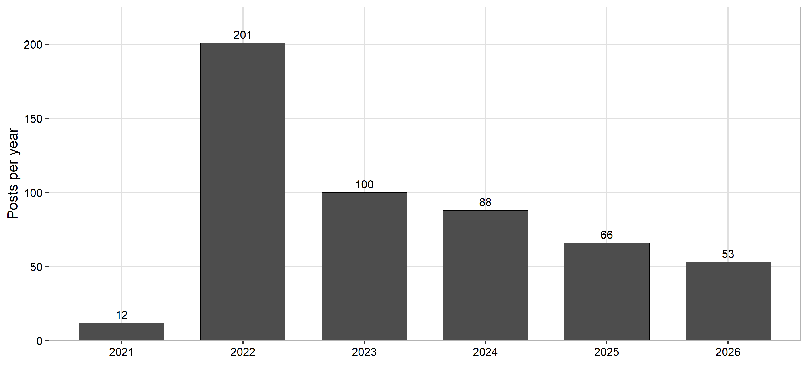
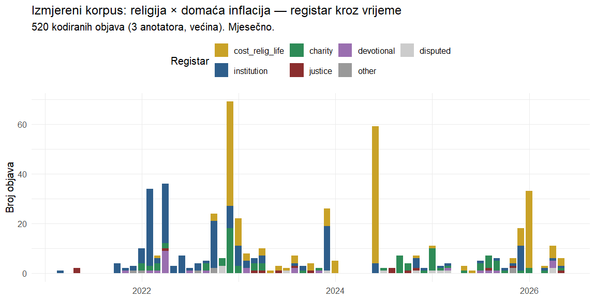
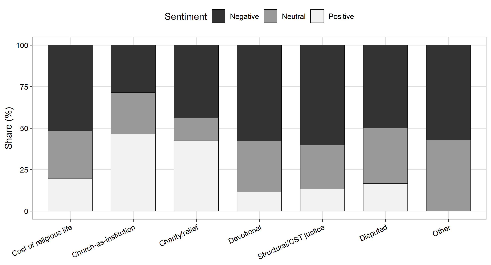
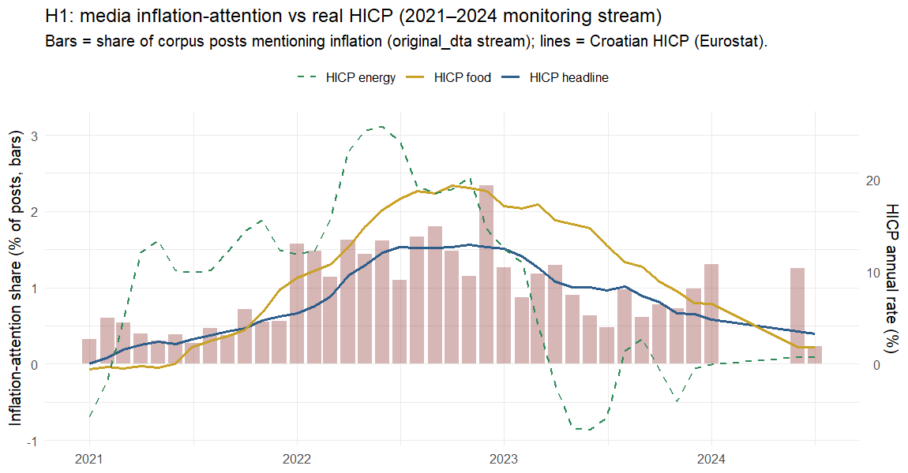

**LUKA ŠIKIĆ**, doc. dr. sc. \*
Catholic University of Croatia (Hrvatsko katoličko sveučilište)
Department of Communication Studies
Zagreb, Croatia

**PETRA PALIĆ**, izv. dr. sc.
Catholic University of Croatia (Hrvatsko katoličko sveučilište)
Department of Communication Studies
Zagreb, Croatia

**MISLAV SAGOVAC**, dr. sc.
Catholic University of Croatia (Hrvatsko katoličko sveučilište)
Department of Communication Studies
Zagreb, Croatia

Original scientific paper
UDK: [to be assigned by the journal]
doi: [to be assigned by the journal]
Received: [month and year, assigned upon submission]

---

Catholic Social Teaching (CST) calls the Church to name inflation as an injustice against the poor. We ask how that voice actually sounds in a national digital media space during a cost-of-living shock. From the DigiKat corpus of 710,307 religion-salient Croatian and Bosnian media posts (2021–2026), we isolate inflation mentions and separate genuine religion-inflation linkage from incidental co-occurrence. After coding 1,450 candidates with three language-model annotators, a measured domestic core of 520 posts remains. Within it, religion meets inflation overwhelmingly as an economic object: the rising cost of religious life and the Church as an institution together account for about 72% of posts, while the structural-justice register CST foregrounds reaches at most 8%. Media attention tracks real prices (Pearson r about 0.73), yet the religious justice voice does not fill it. In keyword-filtered corpora, co-occurrence is not engagement, and linkage must be measured, not counted.

**Keywords:** digital religion, inflation salience, Catholic Social Teaching, media framing, agenda-setting, Croatia, computational text analysis.

---

\* Corresponding author: Luka Šikić, doc. dr. sc., Catholic University of Croatia, Department of Communication Studies / Hrvatsko katoličko sveučilište, Odjel za komunikologiju, Ilica 242, 10000 Zagreb, Croatia / Hrvatska, luka.sikic.gm@gmail.com

---

## INTRODUCTION

Between 2021 and 2026 Croatia lived through the sharpest cost-of-living shock in a generation, compounded by the
adoption of the euro on 1 January 2023. Catholic Social Teaching has an unusually explicit stance on such
moments: from the "preferential option for the poor" to Pope Francis's "this economy kills" (*ova ekonomija
ubija*), doctrine frames economic hardship as a structural injustice the Church is called to name on behalf
of the vulnerable. In a country where the Catholic Church is a dominant cultural institution and operates one
of Europe's more developed religious media ecosystems, one might expect the digital public sphere to carry an
audible religious-economic voice when prices spike.

This paper asks a deliberately simple question: when inflation surfaces in religion-salient Croatian digital
discourse, who carries it, and in what register? We do not assume the Church is loud on the economy. We
measure whether it is, and how. The answer turns out to be less about prophecy than about price lists.

Three contributions follow. Substantively, we provide the first measurement of the religious register of
inflation discourse across an entire national digital media space, and we document a gap between CST's normative
promise and observed practice. We combine this description with four theory-derived hypotheses and propositions
(see below). One of them, that media inflation-attention tracks real prices, is tested quantitatively against
the Harmonised Index of Consumer Prices (HICP) and found to be partially supported. Another, the CST-derived
expectation of a prophetic justice voice, is evaluated and found not to be visible in the digital-news measure,
since a news corpus cannot test the actor-level claim about the Church itself. Methodologically, we show that
the naïve approach of counting posts where religion and inflation co-occur overstates genuine engagement by
roughly an order of magnitude (about 8,000 co-mentions versus 520 measured), and we demonstrate a validated
pipeline for measuring linkage rather than co-occurrence.

## BACKGROUND AND HYPOTHESES

The study sits at the intersection of three literatures that are each well developed but rarely meet.

Public and media attention to inflation is non-linear. It stays flat until inflation crosses a threshold of
roughly 2 to 4%, then jumps (Korenok, Munro and Chen, 2026; Pfäuti, 2024). Coverage is less about the headline
rate than about who is hurt and which component, reflected in the "heating or eating" framing of food
versus energy (Champagne et al., 2024). The European Central Bank now maintains a dictionary-based media
inflation-attention index (Aarab et al., 2025). Agenda-setting theory (McCombs and Shaw, 1972) is the backdrop,
with an open question of whether media set or merely reflect attention (Wlezien and Soroka, 2024). A second
level of that theory matters here. Attribute agenda-setting (McCombs, 2004) holds that media transfer not
only the salience of an issue but the salience of its attributes. Our register question is precisely an
attribute question: it asks not whether religion-and-inflation is on the agenda, but which of its faces (the
fee, the charity, the injustice) becomes salient. This literature is almost entirely secular and Anglophone or
euro-area. It says nothing about the religious media sphere as an inflation channel.

A second literature concerns CST economic framing. The theological distinction between charity (relieving
symptoms) and justice (changing structures) maps closely onto Iyengar's (1991) episodic-versus-thematic
framing and gives us a measurable construct. The structural critique is not only a Francis-era phenomenon
(Benedict XVI, 2009; Francis, 2013). But existing studies examine secular press coverage of poverty, not
religious media as the storyteller.

A third literature concerns Croatian Catholic media, which are well studied on identity, nation, and
culture-war themes, but whose coverage of the economy has never been measured, still less linked to a live
cost-of-living shock.

A gap follows, along with a fourth, methodological one. No work has asked what register religion takes when it
meets inflation in a whole national digital space. And studies of "religion and X" in large corpora routinely
equate co-occurrence with engagement. We show below why that is unsafe here.

### Hypotheses and propositions

The study is primarily descriptive, but prior theory licenses explicit, testable expectations. We state two
directional hypotheses, where theory predicts a direction and the data permit a quantitative test, and two
theory-derived propositions, evaluated by pattern-matching against the coded evidence in the interpretive
tradition (Yin, 2018).

The first hypothesis, H1, concerns attention-price coupling. From inflation-salience and agenda-setting theory,
media attention to inflation should rise with the real HICP and jump once inflation crosses a threshold of
about 4%, with the food and energy components at least as salient as the headline rate. This is tested against
Croatian HICP (see Results). The second hypothesis, H2, concerns resonance rather than setting. From the
setter-versus-resonance debate, religious inflation coverage should resonate with real conditions rather than
lead them, entering the discourse reactively as an affected party. This is assessed via the temporal pattern,
though a formal lead-lag test is left to future work. The third expectation, P3, is the prophetic-actor
proposition. If the Church functions as a prophetic economic actor in the digital public sphere, the
structural or CST-justice register should be non-trivial and should rise with hardship. This is evaluated
against the coded register distribution and its time path. The fourth expectation, P4, following Iyengar
(1991), holds that framing should be episodic over thematic. Religious framing of inflation should be
predominantly episodic (relief, institutional, the price of services) rather than thematic (structural
critique), evaluated against the register distribution.

We deliberately avoid inferential machinery that observational data of this kind cannot bear. The first
hypothesis is tested by a correlation and a threshold contrast, and the propositions by pattern-matching.

## DATA AND METHODS

The DigiKat master is a topical corpus of 710,307 Croatian and Bosnian media posts collected continuously from
January 2021 to June 2026. A post enters the corpus when it contains at least two distinct religious terms. The
corpus therefore holds religion-salient posts from across the whole media space, not a Catholic-outlet archive.
Secular mainstream outlets dominate, and 96% of the core is web-portal content, with 2% from Facebook and the
rest negligible. Collection intensity was not perfectly uniform over the six years, so year-to-year volumes are
best read as indicative rather than exact.

To identify the relevant posts, we tagged every post whose title or body matches an anchored inflation lexicon.
The lexicon covers words for inflation and rising prices, such as *inflacija*, *poskupljenje* ("becoming more
expensive"), *rast cijena* ("price rises"), *trošak života* ("cost of living"), and *kupovna moć* ("purchasing
power"), while deliberately excluding the bare word *cijena* ("price") to avoid devotional false positives such
as "the price of salvation". A metaphor guard removes figurative uses such as "inflation of words" or "inflation
of values". This yields 8,019 clean inflation-mentioning posts, or 1.13% of the corpus.

Mentioning inflation is not the same as being linked to it. A long news article can mention inflation in one
paragraph and a saint's feast in another with no connection. We therefore measured, for each inflation post,
whether a religious term (project lexicon of 95 terms, tightened for economic homonyms such as *gospodarstvo*
"economy" vs *Gospa* "Our Lady") appears within ±220 characters of an inflation mention. This proximity filter
is deliberately recall-oriented (validated recall ≈0.89): it generates 1,450 candidate linked posts while
accepting false positives, which the coding stage removes. We code the full linked set (1,450) rather than
the classifier's narrower domestic-linked subset (1,103), because the automatic foreign/domestic flag is
unreliable (held-out precision of about 0.39). The annotators, not the flag, decide foreign versus domestic.

The candidates were then coded. All 1,450 candidates were coded by three independent annotators, each a large
language model applying the same fixed codebook, and the final label for each post was the majority of the
three. Of the 1,450 posts, 1,447 were coded by all three annotators. Each post was judged on four axes.

The first axis asked whether the post is genuinely about inflation or the cost of living, rather than using an
inflation word only in passing. The second, and most important, asked whether religion is genuinely connected
to that economic content. Here the annotators had to rule out the many ways religion and inflation can appear
together with no real link. A church might be named only as a geographic landmark, the word "inflation" might
be a metaphor such as an "inflation of values", a religious term might sit in a hashtag, or it might belong to
a secular organisation whose name merely contains a religious word, as with *Crveni križ* (the Red Cross) or a
*Papa-test* (a Pap smear). A post counted as linked only when the religious element and the inflation element
belonged to the same story rather than to two unrelated parts of a long article. The third axis asked whether the inflation
in question was domestic or foreign, since Croatian media report price rises abroad frequently and those cases
had to be separated from the domestic one. The fourth axis, applied only to genuinely linked posts, recorded
the register in which religion met inflation: the cost of religious life (the price of religious goods or
services rising), the Church as an institution (clergy, the Pope, or a parish acting or commenting), structural
or CST justice, charity (Caritas and relief work), devotional framing, or other. The register was the hardest
judgement, because a post could touch more than one, so annotators assigned the register that best captured its
main emphasis.

We validated the coding on a stratified held-out sample of 80 posts, disjoint from any tuning data.
Inter-annotator agreement was high (infl 0.975, link 0.967, foreign 0.992), confirming that the constructs are
reliably measurable. Register is the harder judgement, with a held-out agreement of only 0.46. The proximity
filter's held-out precision for domestic linkage was modest (about 0.38 to 0.46) with a recall of about 0.89,
meaning it functions as a filter rather than a labeller. The full-pool coding confirmed this, with 45% of
candidates coded as genuinely linked. We therefore report coded figures throughout and never regex counts.
Annotators are LLM-based, so the agreement reflects inter-model reliability rather than a human gold standard,
and a human double-coding pass is planned (see Limitations).

For the price comparison, the Croatian HICP annual rate of change (monthly, covering all items, food, and
energy) was obtained from Eurostat for 2021 to 2025.

The analysis that follows reports three things: the path from the full corpus down to the measured core, the
register distribution together with its outlet, temporal, and tonal structure, and a test of the first
hypothesis relating monthly inflation-attention to HICP.

## RESULTS

### Co-occurrence is not engagement

The path from corpus to measured core is steep (Table 1). Of 710,307 posts, 8,019 (1.13%) mention inflation. Of
those, the recall-oriented filter flags 1,450 as candidate-linked, and coding confirms only 652 as genuine
religion–inflation linkage. Of these, 132 concern foreign inflation, leaving a domestic measured core of
520 posts, 0.07% of the corpus and 6.5% of inflation-mentioning posts. A naïve co-occurrence count would
have reported the phenomenon as an order of magnitude larger than it is. Even among the proximity-flagged
candidates, just 45% survive coding. The 520 is itself a floor rather than a point estimate. At the filter's
validated recall of about 0.89, estimated on an 80-post held-out sample, roughly sixty genuine domestic posts
are missed before coding, giving a recall-corrected estimate of about 584. All shares below use the measured
520 as the denominator.

Table 1
*From corpus to measured core*

| Stage | n | % of corpus |
|---|---:|---:|
| Full religion-filtered corpus | 710,307 | 100.000 |
| Mentions inflation (clean) | 8,019 | 1.129 |
| Linked candidates (filter, recall ≈0.89) | 1,450 | 0.204 |
| Confirmed religion-linked (coded) | 652 | 0.092 |
| … foreign inflation | 132 | 0.019 |
| … domestic (measured core) | 520 | 0.073 |

Source: Authors' calculation from the DigiKat corpus.

### Who carries it

Genuine religion-and-inflation discourse is overwhelmingly a secular-media phenomenon. Of the 520 posts, 442
(85%) come from secular or mainstream outlets, 75 (14%) from Catholic outlets, and only 3 from the business
press (Table 3). The single largest producer is the Catholic aggregator *hkm.hr*, with 56 posts. It is followed
by mainstream titles such as *slobodnadalmacija.hr* (17 posts), *novilist.hr* (16), *24sata.hr* (12),
*jutarnji.hr* (11), and *večernji.hr* (10). The Church's own outlets are not where this discourse mainly lives.

### The register of religious-economic discourse

The central result is the register distribution (Table 2, Figure 1). Religion meets domestic inflation as, in
order: the cost of religious life (37.3%), the Church as an institution (34.4%), charity (16.7%), devotional
framing (5.0%), and the structural or CST-justice register at just 2.9%, or 15 posts.

Two cautions attach to this table. First, the two leading registers are close in size, share the same
vocabulary (words like *crkva* and *biskup*), and register was the axis annotators agreed on least (agreement
of 0.46), so their exact ordering falls within coding noise. The safe statement is that together they form an
economic-object macro-register of about 72%, or 373 posts. Second, the 3% justice figure is a strict floor. If
we also count posts placed in other registers whose text still carries a structural argument, chiefly charity
posts such as Caritas discussing structural poverty, the figure rises to at most 8%, or 43 posts. Justice is
marginal on either definition.

Table 2
*Register of the domestic core (n = 520)*

| Register | n | % |
|---|---:|---:|
| Cost of religious life | 194 | 37.3 |
| Church-as-institution | 179 | 34.4 |
| Charity / relief | 87 | 16.7 |
| Devotional | 26 | 5.0 |
| Structural / CST justice | 15 | 2.9 |
| Disputed (pending human tiebreak) | 12 | 2.3 |
| Other | 7 | 1.3 |

Source: Authors' calculation from the DigiKat corpus.

Figure 1
*Register composition of the measured core*

{width=85%}

Source: Authors' calculation from the DigiKat corpus.

The two dominant registers describe the Church as an economic object, not a moral voice: masses, church fees,
weddings, funerals and pilgrimages that became more expensive ("cost of religious life"), and clergy or dioceses
appearing in economic news as commentators or affected parties ("institution"). The second register also
carries a definitional caveat. It includes clergy appearing as commentators, speaking subjects, some of whom
voice moral or economic judgements, alongside the Church as an affected party. The "economic-object" reading of
the ≈72% macro-register is therefore an upper bound, and splitting the institution register into subject and
object is deferred to the planned human coding round (see Limitations).

An outlet pattern is visible but must be read cautiously (Table 3, Figure 2). The "cost of religious life"
register is almost entirely a secular story: 189 of 194 such posts are secular outlets reporting that the
Church raised its prices. A tempting reading is that Catholic outlets, when they engage, tilt toward charity
(27/75, or 36%, of the Catholic core versus 58/442, or 13%, of the secular core). We do not press this claim.
The Catholic subsample is small (n = 75), 75% of it is the single aggregator *hkm.hr* (56 posts) whose own top
register is institution (27), not charity (18), and stripping *hkm.hr* leaves just 19 posts. We therefore
report the direction as a hypothesis for a larger Catholic-outlet sample, not a finding. What is robust across
outlets is the near-absence of the justice register (10 secular, 5 Catholic).

Table 3
*Register by outlet type (counts)*

| Register | Secular/other | Catholic | Business |
|---|---:|---:|---:|
| Cost of religious life | 189 | 4 | 1 |
| Church-as-institution | 147 | 32 | 0 |
| Charity / relief | 58 | 27 | 2 |
| Devotional | 22 | 4 | 0 |
| Structural / CST justice | 10 | 5 | 0 |
| Other / disputed | 16 | 3 | 0 |

Source: Authors' calculation from the DigiKat corpus.

Figure 2
*Register composition by outlet type (shares)*

{width=85%}

Source: Authors' calculation from the DigiKat corpus.

### Temporal dynamics

The measured core tracks the shock itself over the six years (Figure 3, Table 4). It rises sharply to a peak of
201 posts in 2022, at the height of the energy shock, and then declines as prices stabilise, to 100 posts in
2023, 88 in 2024, 66 in 2025, and 53 in the first half of 2026. Attention builds as prices climb and recedes as
they ease. Because collection intensity varied over the period, the exact year-to-year figures are indicative,
but the rise and fall are clear.

Figure 3
*Measured core volume by year*

{width=85%}

Note: 2026 covers only the first half of the year.
Source: Authors' calculation from the DigiKat corpus.

The register composition also shifts over the period (Figure 4, Table 4). The institution register dominates
the 2022 shock, with 105 posts of clergy commenting on the crisis, and then recedes, to 38 posts in 2023 and 9
in 2024. The cost-of-religious-life register moves the other way, climbing to 61 posts in 2024 as churches
revise their fees around the euro changeover of 1 January 2023. The discourse thus appears to migrate from
acute-crisis commentary toward institutional price adjustment. The changeover was itself a cross-sectoral media
event that prompted price-transparency and rounding-up coverage across the whole economy, so part of the
cost-of-religious-life rise around it plausibly reflects changeover journalism rather than inflation alone. We
treat this shift as suggestive rather than established. At no point over the six years does the justice register
gain traction.

Table 4
*Register by year (counts, full core)*

| Year | Institution | Cost-relig-life | Charity | Devotional | Justice | Other/disputed |
|---|---:|---:|---:|---:|---:|---:|
| 2021 | 8 | 0 | 0 | 1 | 2 | 1 |
| 2022 | 105 | 41 | 34 | 13 | 1 | 7 |
| 2023 | 38 | 39 | 11 | 5 | 5 | 2 |
| 2024 | 9 | 61 | 12 | 0 | 4 | 2 |
| 2025 | 16 | 13 | 26 | 4 | 2 | 5 |
| 2026 | 3 | 40 | 4 | 3 | 1 | 2 |

Note: 2026 covers only the first half of the year.
Source: Authors' calculation from the DigiKat corpus.

Figure 4
*Register over time, by year (measured core)*

{width=85%}

Source: Authors' calculation from the DigiKat corpus.

### Tone

Vendor auto-sentiment (indicative only) splits meaningfully by register (Table 5, Figure 5). The core is 43%
negative, 32% positive, 25% neutral overall, but "cost of religious life" is markedly negative (100 of 194,
51%), consistent with public grumbling about church price hikes, whereas "Church-as-institution" is the most
positive register (83 of 179, 46%), consistent with pastoral or commentary framing. The rare justice posts lean
negative (9 of 15).

Table 5
*Auto-sentiment by register (counts, vendor labels, indicative)*

| Register | Negative | Neutral | Positive |
|---|---:|---:|---:|
| Cost of religious life | 100 | 56 | 38 |
| Church-as-institution | 51 | 45 | 83 |
| Charity / relief | 38 | 12 | 37 |
| Devotional | 15 | 8 | 3 |
| Structural / CST justice | 9 | 4 | 2 |

Source: Authors' calculation from the DigiKat corpus (vendor auto-sentiment labels, indicative only).

Figure 5
*Auto-sentiment by register (shares)*

{width=85%}

Source: Authors' calculation from the DigiKat corpus.

### Inflation attention and real prices

To test the first hypothesis we relate monthly inflation-attention, the share of corpus posts that mention
inflation, to the Croatian HICP annual rate of change for headline, food, and energy prices. The monthly test
covers the 39 months from 2021 to mid-2024, the window for which we built the monthly attention series. The
series runs continuously through January 2024 and then has two sparse months, June and July 2024, so it is not
fully contiguous at the end. Over this window attention tracks inflation strongly (Table 6, Figure 6). The
correlation with headline HICP is Pearson r = 0.73 (nominal p < 0.001, with the cautions noted below), 0.72
with food, and 0.44 with energy, and the Spearman ranks are comparable. The threshold pattern also holds as a
description. Mean attention is 0.49% of posts in the 12 months when headline HICP is below 4%, and 1.17% in the
27 months at or above it, a 2.4-fold jump around the 4% threshold documented in other countries.

Three cautions temper the inference. First, the HICP annual rate of change compares each month with the same
month a year earlier, so consecutive monthly values overlap by eleven months and move together closely. The
attention series is also persistent. The number of genuinely independent observations is therefore well below
the nominal 39, and the p-value overstates the precision. We plan an autocorrelation-robust re-estimate and a
month-on-month version before submission, and until then the correlation should be read as descriptive. Second,
the 4% cutpoint is taken from the cross-national literature, not estimated from these data. With only 39 months
the data cannot locate a breakpoint of their own, and we report no formal test of the two-bin contrast. Because
the 12 below-threshold months sit mostly at the start of 2021, the contrast cannot separate a genuine jump from
the smooth rise already described. Third, the January 2023 euro changeover flooded every sector with price coverage,
so part of the 2023 attention is plausibly changeover journalism rather than a reaction to the inflation rate
itself.

On this evidence the hypothesis is partially supported. The coupling and the threshold pattern hold, and food
inflation tracks attention as strongly as the headline rate does, but energy couples only weakly (r = 0.44).
Energy prices swung widely and often turned negative in 2023 and 2024, which loosened their link to attention,
so the "food-and-energy" part of the prediction holds for food but not for energy. This component reading is
indirect, because we relate overall attention to each price component rather than to component-specific
attention, so the weak energy result is suggestive rather than decisive. The coupling is not an artifact of the
ragged tail of the window. It is r = 0.77 on the fully continuous 2021 to 2023 block (n = 36) and r = 0.72 once
the sparsest tail month is dropped. The religion-linked core is too small for a monthly test of its own, but
its yearly volume aligns with inflation, since both peak in 2022.

Table 6
*Inflation-attention versus HICP (monthly, 2021 to mid-2024, 39 months, not fully contiguous)*

| HICP component | Pearson r | Spearman ρ |
|---|---:|---:|
| Headline | 0.73 | 0.75 |
| Food | 0.72 | 0.74 |
| Energy | 0.44 | 0.43 |

Source: Authors' calculation from the DigiKat corpus and Eurostat.

Figure 6
*Inflation-attention versus HICP, 2021 to mid-2024*

{width=85%}

Note: Bars show the share of corpus posts mentioning inflation (left axis). Lines show the Croatian HICP annual rate of change (right axis).
Source: Authors' calculation from the DigiKat corpus and Eurostat.

## DISCUSSION

The dominant way religion meets inflation in Croatian digital discourse is not the pulpit but the price list,
and the Church appears throughout as an economic object rather than a moral voice. Seven in ten linked posts
describe either the rising cost of religious life or the Church as an institution caught up in economic news.
Together these make up the 72% economic-object macro-register, which is itself an upper bound, since the
institution register also holds clergy who speak as commentators (see Results). Charity adds a sixth of the
posts, and the structural-justice critique that CST foregrounds is marginal, at 3% under strict coding and at
most 8% broadly construed. We read this as a claim about what is visible in the digital public sphere, not
about the Church's pastoral conduct. Homilies, pastoral letters, and Caritas fieldwork are largely absent from
a corpus of news posts, so the low visibility of the justice frame is weak evidence about institutional silence
itself (see Limitations). What
the data support is that, in the national digital public sphere, the frame that surfaces around inflation is
overwhelmingly the fee and the institution, not the prophecy.

Newsroom gatekeeping offers a rival explanation. The register distribution is produced by editorial selection
at least as much as by what religious actors say. Standard news values, such as conflict, concrete numbers, and
institutional controversy, favour the church-fee story over the pastoral letter: a diocese raising the price of
a funeral is news, while a homily on structural poverty rarely is. Since 85% of the measured core is secular
outlets' output, the distribution we observe is largely what newsrooms judged newsworthy about religion during
the shock. The "quiet prophets" pattern may therefore be partly editorial deafness rather than clerical
silence. On the present data, the two readings, a Church that does not speak structurally, and media that do
not relay it when it does, cannot be separated. The planned secular benchmark and a supply-side corpus of
Church-authored texts (see Limitations) are designed to separate them.

Attention existed, but a prophetic voice did not fill it. The two results interlock. The attention test shows
that media attention to inflation is real and moves with prices (see Results). Yet within that attention, once
linkage is measured, the religious engagement is small and, where present, non-prophetic. The public
conversation about inflation was there for a religious justice voice to enter, but little of one is visible in
the measured discourse.

A possible division of narrative labour emerges, though it remains a hypothesis. The register-outlet pattern
hints at two storytellers. Secular media supply the "costlier candles" story, reporting, often critically and
in a negative tone, that the Church raised the price of masses, weddings and funerals around the euro
changeover. Catholic outlets, in their thin non-aggregator tail, lean instead toward "quiet charity." As noted
above, the Catholic subsample is too small and too aggregator-dominated to establish this contrast, so we
advance it only as a hypothesis. What both kinds of outlet share is the near-absence of the prophetic,
structural voice.

Mechanism and timing also matter here. The pattern fits an agenda-setting reading. The religious linkage flares
during the acute 2022 shock, mostly as institutional commentary, and recedes as prices stabilise, while
church-fee coverage rises around euro adoption. On this evidence the dynamic looks closer to resonance than to
setting, in line with the second hypothesis, though only provisionally. Religion enters inflation discourse
reactively, as an affected party, rather than as an agenda-setter for economic justice.

This finding matters across three fields. For sociology of religion, it qualifies accounts of the Croatian
Church as a strong public actor: on the economy, at least, its digital-public presence is thin and
non-prophetic. For media studies, it extends inflation-salience research into the religious sphere and shows
that the "who is hurt" framing has a specifically institutional variant: "who charges more." For CST
scholarship, the absence poses the question of why the doctrinal justice frame does not travel into the
national digital public sphere.

Three implications for social policy follow. First, agenda-setting research suggests that media frames shape
which policy responses the public sees as warranted. If so, a digital sphere in which religion meets inflation
as fees and institutional news, rather than as structural injustice, does little to build public support for
redistributive or anti-poverty responses to a cost-of-living shock, even though doctrine points exactly there.
Second, the visible charity register (17%) shows the place the country's main faith-based relief network holds
in the digital public sphere. Caritas appears as an episodic relief actor rather than as an advocate for
structural reform. This is the familiar charity-versus-justice tension in faith-based welfare, here measured
rather than asserted. Third, the dominant cost-of-religious-life register points to a concrete social-policy
object. For religiously observant low-income households, fees for weddings, funerals, and other rites of
passage are close to obligatory expenses. They are a neglected part of cost-of-living measurement, which the
church-fee resets around the euro changeover made briefly and unusually visible.

To summarize the hypothesis scorecard, H1, attention-price coupling, is partially supported: the coupling
holds, though energy couples only weakly. H2, resonance not setting, is provisionally consistent, pending
a lead-lag test. P3, the prophetic-actor proposition, is not visible in the digital-news measure, since the
actor-level claim is not testable here. P4, episodic over thematic, is supported, in part by construction
(see Appendix C).

## METHODOLOGICAL CONTRIBUTION: CO-OCCURRENCE IS NOT ENGAGEMENT

Independent of the substantive story, the study is a cautionary demonstration. Had we counted co-occurrence, we
would have reported thousands of "religious engagements with inflation." Measured, genuine domestic linkage is
520 posts. The gap is not noise to tolerate but signal to remove: keyword-filtered corpora manufacture
incidental co-mention at scale. Our pipeline, combining anchored lexicons with metaphor and homonym guards, a
recall-oriented proximity filter, and multi-annotator coding with reported inter-annotator agreement, is a
reusable template for any "religion and X" (or "A and B") corpus study.

## LIMITATIONS

Several limitations qualify these findings. Collection intensity was not perfectly uniform across the six
years, so the year-to-year volumes should be read as indicative and the exact size of the post-2022 decline is
uncertain. The rise to the 2022 peak and the broad decline afterwards are robust, but the precise annual counts
are not. Inter-annotator agreement is high (0.97), but this is agreement between models, not a human gold
standard. Before final publication we plan a human double-coding of at least 100 posts, including the
foreign-versus-domestic decision that defines the core of 520, together with a resolution of the 12 "disputed"
register cases. The Church-as-institution register is also mixed. It counts both the Church as an affected
party and clergy speaking as commentators, so the economic-object reading of the 72% macro-register is an upper
bound. The planned human round will split this register into affected party and commentator and recompute the
figure on that split. Finally, even after majority coding a few posts are misclassified, so a high-confidence
subset of 518 posts on which all three annotators agreed is available for sensitivity analysis.

Register was the lowest-agreement axis, and the 37% versus 34% ordering is within noise, which is why we report
the ≈72% macro-register, while 3% justice is a strict floor, at most 8% broadly construed. The proximity
filter's misses may also be register-non-random, since long-form thematic argument is likelier to exceed a
±220-character window, so filter design as well as strict coding may depress the justice floor, and a planned
window-sensitivity check addresses this. The attention-price test is also conducted only at the level of
corpus-wide inflation-attention. A monthly HICP overlay on the religion-linked core specifically is too sparse
to test, and the lead-lag test of resonance against public search interest is future work.

Because the corpus is religion-filtered, we cannot yet say whether structural framing is rarer in religious
than in secular inflation coverage, and a benchmark on non-religious inflation posts is needed before any claim
that the Church specifically underuses the justice frame. Finally, "secular" here means secular outlets'
religion-adjacent output, not their full inflation coverage, and the core is also 96% web, so claims generalize
to the web-portal public sphere rather than to all platforms.

## CONCLUSION

When prices rose in Croatia, religion did enter the digital conversation about inflation, but as an institution
whose candles, masses and fees had become more expensive, and whose charities responded, far more than as a
prophetic voice for the poor. Media attention to inflation tracked real prices closely, but the religious
structural-justice frame did not fill that attention. Costlier candles, quiet prophets. Whether this reflects a
genuinely quiet Church, newsroom gatekeeping that finds fees more newsworthy than prophecy, or a justice voice
carried in channels a news corpus does not capture, is the question the absence opens. The planned secular
benchmark and supply-side corpus of Church-authored texts are designed to answer it, with a lead-lag test and
human validation securing the ground beneath them.

## DATA AND CODE AVAILABILITY

The aggregate outputs behind every table and figure, together with the coded data and the HICP price series,
are available on request. The underlying corpus contains scraped post text and is not redistributable, so the
analysis is reproducible from the aggregate data and the analysis scripts rather than from the raw corpus. The
measured-core file carries URLs and text excerpts and is held internally pending a statistical-disclosure
review.

## ETHICS AND DISCLOSURE

The corpus consists of publicly posted media content collected via a commercial monitoring service. The paper
reports only aggregate counts and shares. No personal data, account identifiers, or verbatim private content are
published. Outlet names are public publishers. A disclosure/PII screen is run before any data extract is shared.

## ACKNOWLEDGMENTS

This research was conducted within the DigiKat project at the Catholic University of Croatia (Hrvatsko katoličko
sveučilište), Department of Communication Studies. This is a working manuscript (first complete version,
1 July 2026), and authorship and author order are to be finalized. It is released under CC BY 4.0, and
open-science (FAIR) principles apply.

## REFERENCES

- Aarab, I., Bańbura, M., Bobeica, E., & Leguay, T. (2025). Tracking inflation attention. *ECB Economic Bulletin* 6/2025.
- Benedict XVI (2009). *Caritas in Veritate.*
- Champagne, C., et al. (2024). "Heating or eating": framing the cost-of-living crisis. *Social Science & Medicine, 360*, 117312.
- Francis (2013). *Evangelii Gaudium.*
- Geiß, S. (2022). Conditional agenda-setting. *Communication Research, 49*(2), 296–323.
- Gutiérrez, G. (1971/1973). *A Theology of Liberation.* Orbis.
- Iyengar, S. (1991). *Is Anyone Responsible?* University of Chicago Press.
- Korenok, O., Munro, D., & Chen, J. (2026). Inflation and attention thresholds. *Review of Economics and Statistics, 108*(3), 842–850.
- Lamla, M. J., & Maag, T. (2012). The role of media for inflation expectations. *Journal of Money, Credit and Banking, 44*(7), 1325–1350.
- McCombs, M. (2004). *Setting the Agenda: The Mass Media and Public Opinion.* Polity Press.
- McCombs, M. E., & Shaw, D. L. (1972). The agenda-setting function of mass media. *Public Opinion Quarterly, 36*(2), 176–187.
- Pfäuti, O. (2024). The inflation attention threshold. arXiv:2308.09480.
- Wlezien, C., & Soroka, S. (2024). Media and the public's attention. *American Political Science Review, 118*(3), 1563–1569.
- Yin, R. K. (2018). *Case Study Research and Applications: Design and Methods* (6th ed.). Sage.

Some literature entries remain to be verified against Hrčak and CrossRef before submission. The price data are
the Croatian HICP annual rate of change (all items, food, and energy, monthly) from Eurostat, retrieved on 1
July 2026.

## APPENDIX A. REPRODUCIBILITY

The analysis proceeds in five stages. We first tag inflation mentions and identify candidate religion-inflation
links in the corpus. We then assemble the 1,450-candidate pool and prepare it for coding. Three annotators code
the pool independently, and their labels are combined by majority. From the coded pool we derive the measured
core, and from the core we compute the register, outlet, and sentiment tables and figures and the
attention-price test against HICP. The analysis scripts and the coded data behind every table and figure are
available on request. The underlying corpus of scraped post text is not redistributable.

## APPENDIX B. CODING PROTOCOL AND VALIDATION

The four coding axes are described in the Data and Methods section. In held-out validation (n = 80),
inter-annotator agreement was 0.975 for inflation, 0.967 for linkage, 0.992 for foreign versus domestic, and
0.46 for register. The proximity filter's held-out precision for domestic linkage was about 0.38 to 0.46, with
a recall of about 0.89. Full-pool coding confirmed that 45% of candidates were genuinely linked.

## APPENDIX C. HYPOTHESIS SCORECARD

Table C1
*Hypothesis scorecard*

| # | Statement | Test | Verdict |
|---|---|---|---|
| H1 | Attention rises with HICP, jumps above about 4%, food and energy at least as salient as headline | Correlation + threshold contrast (Results) | Partially supported (r about 0.73, attention 0.49% to 1.17% across the threshold, food about equal to headline, but energy only weakly coupled at r = 0.44) |
| H2 | Religious coverage resonates rather than leads | Temporal pattern (Results, Discussion) | Provisionally consistent, with a lead-lag test still pending |
| P3 | If prophetic actor, justice register non-trivial and rises with hardship | Pattern-matching (Results) | Not visible in the digital-news measure (3% under strict coding, at most 8% broadly, with no rise over time), since the actor-level claim is not testable in a news corpus |
| P4 | Framing episodic, not thematic | Register distribution (Results) | Supported (episodic registers $gg$ thematic justice), though partly by construction: justice is definitionally the thematic register |

Source: Authors' compilation.

---

## Sažetak

**SKUPLJE SVIJEĆE, TIHI PROROCI: KAKO SE RELIGIJA SUSREĆE S INFLACIJOM U HRVATSKOME DIGITALNOM MEDIJSKOM PROSTORU, 2021.–2026.**

**Luka Šikić**, doc. dr. sc.
Hrvatsko katoličko sveučilište, Odjel za komunikologiju
Zagreb, Hrvatska

**Petra Palić**, izv. dr. sc.
Hrvatsko katoličko sveučilište, Odjel za komunikologiju
Zagreb, Hrvatska

**Mislav Sagovac**, dr. sc.
Hrvatsko katoličko sveučilište, Odjel za komunikologiju
Zagreb, Hrvatska

Katolički socijalni nauk (KSN) poziva Crkvu da inflaciju imenuje kao nepravdu prema siromašnima. Pitamo kako taj glas doista zvuči u nacionalnome digitalnom medijskom prostoru tijekom šoka troškova života. Iz korpusa DigiKat od 710 307 religijski relevantnih hrvatskih i bosanskih objava (2021.–2026.) izdvajamo spomene inflacije i razlikujemo istinsku povezanost religije i inflacije od slučajnoga supojavljivanja. Nakon kodiranja 1 450 kandidata s trima jezičnim modelima ostaje izmjereni domaći korpus od 520 objava. U njemu se religija s inflacijom susreće pretežno kao s gospodarskim predmetom: rastući trošak religijskoga života i Crkva kao institucija zajedno čine oko 72 % objava, dok registar strukturne pravde koji KSN ističe doseže najviše 8 %. Medijska pozornost prati stvarne cijene (Pearsonov r oko 0,73), no religijski glas pravde ne ispunjava tu pozornost. U korpusima filtriranima ključnim riječima supojavljivanje nije angažman, a povezanost treba mjeriti, a ne brojati.

**Ključne riječi:** digitalna religija, istaknutost inflacije, katolički socijalni nauk, medijsko uokvirivanje, postavljanje dnevnoga reda, Hrvatska, računalna analiza teksta.
